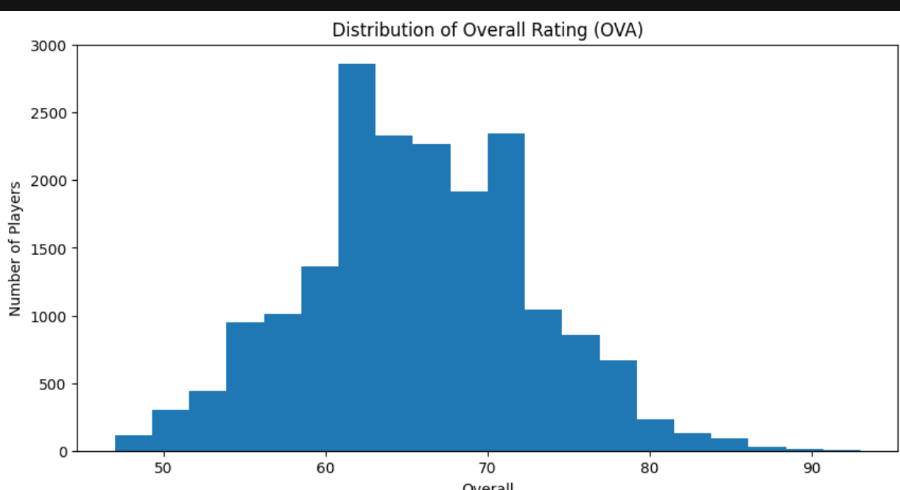
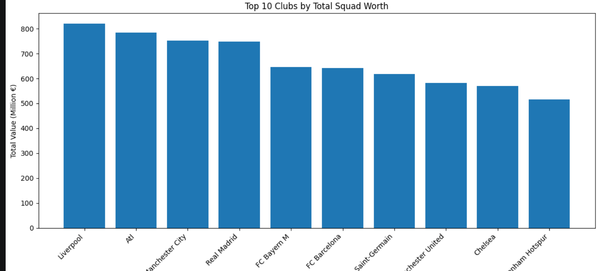
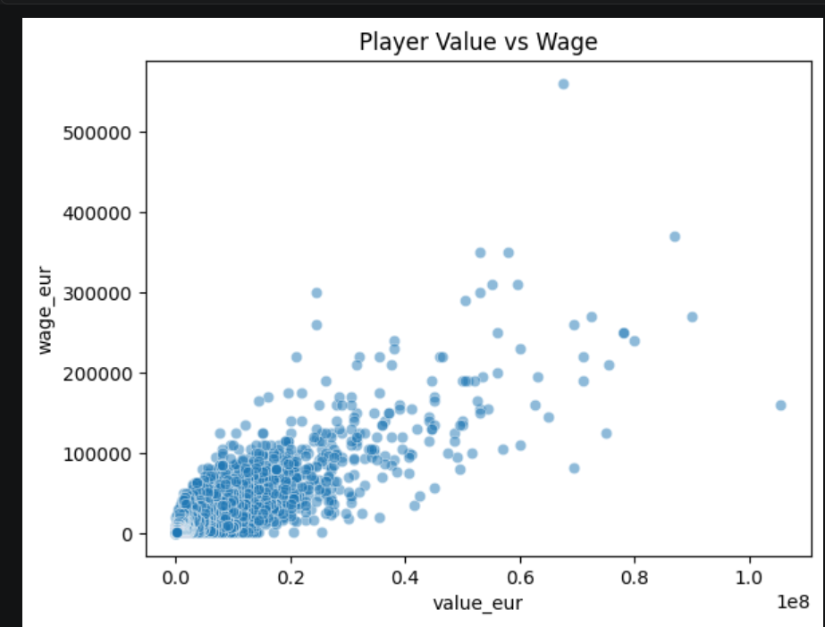

# FIFA 21 Data Analysis Project

## Overview
This project focuses on data cleaning and exploratory data analysis of FIFA 21 dataset.

## Folder Structure
- fifa_analysis.ipynb → cleaning + EDA
- fifa_cleaned.csv → cleaned dataset

## Key Insights
- Player rating distribution
- Top clubs by squad value
- Nationality distribution
- Value vs wage relationship
- Position analysis

## Tools Used
- Python
- Pandas
- Matplotlib
- Seaborn
## Visualizations

 

## Dataset
FIFA 21 dataset (Kaggle)
